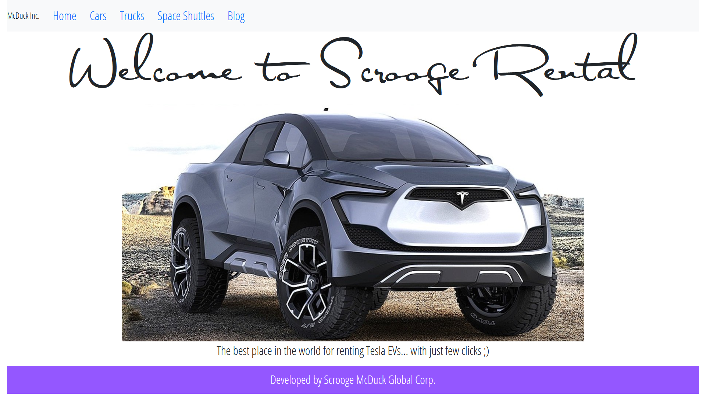
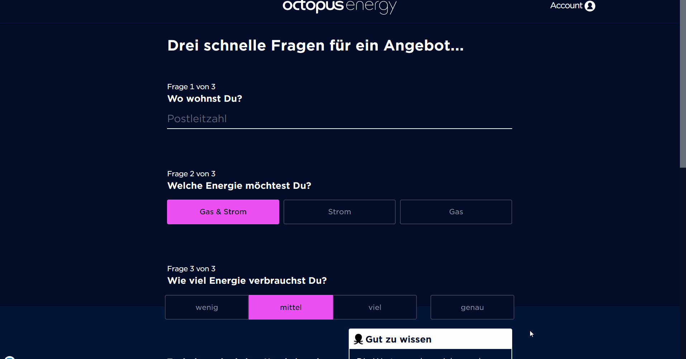
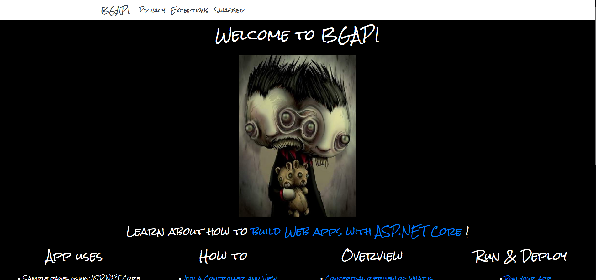
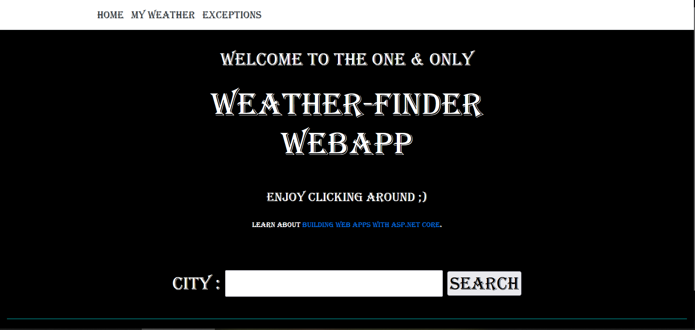
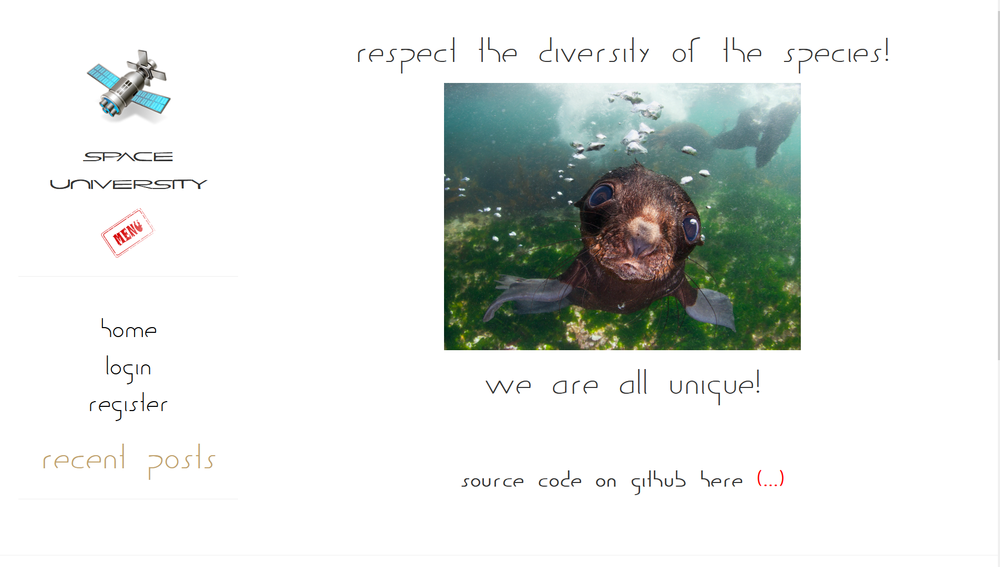
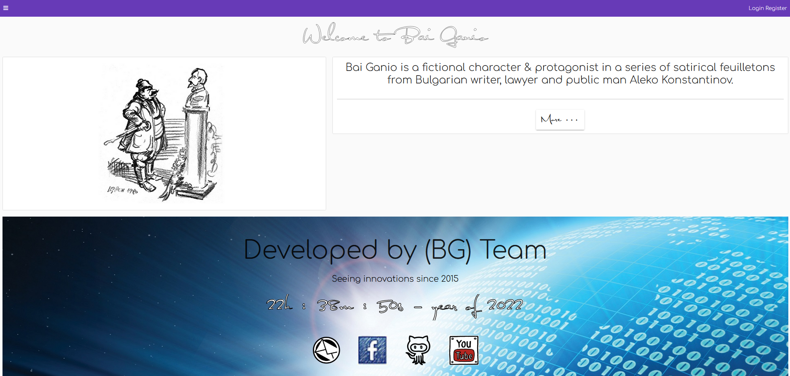
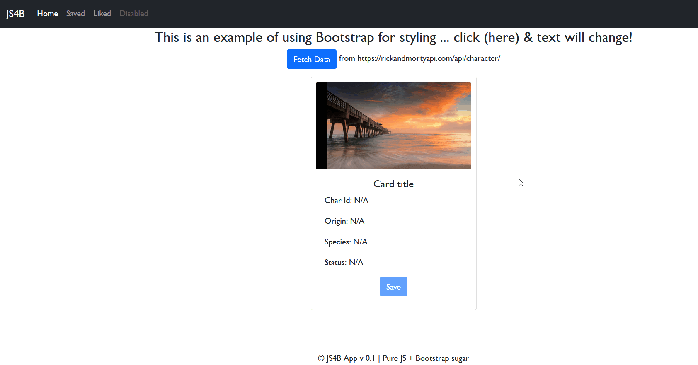

<a target="_blank" href="https://www.bbc.com/news/in-pictures-35639575" title="(BBC News) In pictures: Sony World Photography Awards shortlist -> Andrey Narchuk's photograph of an inquisitive baby fur seal in the Bering Sea is shortlisted in the Open Nature and Wildlife section.">
  
</a>

`"I've seen people who can solve complex problems, and I admire them. But, I'm not one of them. When I have to solve a complex problem, I make it simple first..."` - Unknown

`"Knowledge is power. Knowledge shared is power multiplied."` - Robert Noyce

`"Not in time, place or circumstances, but in man lies success."` - Charles B. Rouss

<p align="center">
  <a href="#">
    
  </a>
  <a href="https://www.linkedin.com/in/lyuben-kikov-617a90101/">
    
  </a>
  <a href="https://www.facebook.com/baiganio.github.io">
    
  </a>
  <a href="https://www.youtube.com/channel/UCczegwwjd8YyeophFBIJ4EA">
    
  </a>
</p>

---
### &#x1f4c8; _Statistics_

<a href="https://github.com/BaiGanio/BaiGanio">
        
      </a>

<a href="https://github.com/BaiGanio/BaiGanio">
  
</a>

 <!--START_SECTION:waka-->

```text
From: 20 June 2022 - To: 27 June 2022

Markdown   39 mins         ███████████████▒░░░░░░░░░   61.36 %
JSON       15 mins         ██████░░░░░░░░░░░░░░░░░░░   23.83 %
YAML       9 mins          ███▓░░░░░░░░░░░░░░░░░░░░░   14.81 %
```

<!--END_SECTION:waka-->


---

### _Projects available so far?!?!_
Read the _`README.md`_ file in each repo, otherwise the working project might turn into broken one... ;) 😄🤔

<table bordercolor="#66b2b2">
  <!-- START Scrooge Rental web and API project secrtion -->
  <tr>
    <td valign="top">
      <hr />
      <h3>Scrooge Rental</h3>
        <span>Demo example on how rent-a-car site might look like.
        Built using React.js, GitHub pages, Material UI, GraphQL... & some other data for alignment
        </span>
      <br/>
      <br/>
      <a href="https://baiganio.github.io/Scrooge-Rental/">
        
      </a>
      <hr />
      <p>(Repo): <a target="_blank" href="https://github.com/BaiGanio/Scrooge-Rental"><em>https://github.com/BaiGanio/Scrooge-Rental</em></a> </p>
      <p>(Site): <a target="_blank" href="https://baiganio.github.io/Scrooge-Rental/"><em>https://baiganio.github.io/Scrooge-Rental</em></a></p>
    </td>
     <td valign="top">
      <hr />
      <h3>Scrooge Rental API</h3>
    <span>Azure Cloud hosted, .NET 6 API supporting GraphQL & using free SQL Server from AppHarbor. Demo example of using Azure Service Bus & Azure Function to sparkle the picture.</span>
      <br/>
       <br/>
      <a href="https://raw.githubusercontent.com/BaiGanio/scrooge-rental-api/master/Docs/scrooge_rental_microservices.png">
        
      </a>
      <hr />
      <p>(Repo): <a target="_blank" href="https://github.com/BaiGanio/scrooge-rental-api"><em>https://github.com/BaiGanio/scrooge-rental-api</em></a></p>
      <p>(Site):  <a target="_blank" href="https://scrooge-rental-api.azurewebsites.net/graphql/"><em>https://scrooge-rental-api.azurewebsites.net/graphql</em></a></p>
    </td>   
  </tr>  
  <!-- END Scrooge Rental web and API project secrtion -->
  <!-- START OEG & Looney Tooney section -->    
  <tr>
    <td valign="top">
      <hr />
      <h3>Octopus Energy Germany (OEG)</h3>
        Digital energy retailer I worked for.
      <br/>
        React, Angular, Azure Service Fabric (multiple .NET APIs configured), Azure Cloud, Azure SQL Server, Azure Storage, Azure Functions, Azure Service Bus & much more....
      <br/>
      <br/>
      <a target="_blank" href="https://raw.githubusercontent.com/BaiGanio/BaiGanio/master/images/oeg.gif">
        
      </a>
      <hr />
      <p>(Site): <a target="_blank" href="https://my.octopusenergy.de/quote"><em>https://my.octopusenergy.de/quote</em></a></p>
    </td>
    <td valign="top">
      <hr />
      <h3>Looney Tooney</h3>  
      <br/>        
        GitHub Pages hosted, pure JavaScript game as a team project back in the days...
       <br/>
      <br/>
      <br/>
      <a target="_blank" href="https://team-kepler.github.io/looney-tooney/CanvasGame.html">
        
      </a>
      <hr />
      <p>(Repo): <a target="_blank" href="https://github.com/Team-Kepler/looney-tooney"><em>https://github.com/Team-Kepler/looney-tooney</em></a></p>
      <p>(Site): <a target="_blank" href="https://team-kepler.github.io/looney-tooney/CanvasGame.html"><em>https://team-kepler.github.io/looney-tooney/CanvasGame.html</em></a></p>
    </td>
  </tr>
  <!-- END OEG & Looney Tooney section -->    
  <!-- START Free IS4 & BGAPI section -->                                                                              
  <tr>                                                                         
    <td valign="top">
      <hr />
      <h2><em>Free IS4</em></h2>     
       Self hosted Identity Server 4 middleware implementation supporting BaiGanio ecosystem of web clients & APIs. Azure SQL Server for storing data. Should be Blazor Web app, but don't know at what timeline it should happen ;)
      <br/>
      <br/>
      <a target="_blank" href="https://free-is4.azurewebsites.net/">
        
      </a>
      <hr />
      <p>(Repo): <a target="_blank" href="https://dev.azure.com/teamkepler/_git/Free-IS4"><em>https://dev.azure.com/teamkepler/_git/Free-IS4</em></a></p>
      <p>(Site): <a target="_blank" href="https://free-is4.azurewebsites.net/"><em>https://free-is4.azurewebsites.net</em></a></p>
    </td>
    <td valign="top">
      <hr />
      <h2><em>BGAPI</em></h2>     
     .NET 6 Web API supporting GraphQL designed to allows BaiGanio, BackOffice & other public clients to fetch & manipulate public data. Hosted and lives in Azure Cloud, manages data via Azure SQL Server, Firebase NoSQL database as well as Cosmos DB.
      <br/>
      <br/>
      <a target="_blank" href="https://bgapi.azurewebsites.net/"></a>   
    <hr />
    <p>(Repo): <a target="_blank" href="https://dev.azure.com/teamkepler/_git/BGAPI"><em>https://dev.azure.com/teamkepler/_git/BGAPI</em></a></p> 
    <p>(Site): <a target="_blank" href="https://bgapi.azurewebsites.net/"><em>https://bgapi.azurewebsites.net</em></a></p>   
    </td>
  </tr>
  <!-- END Free IS4 & BGAPI section -->  
  <!-- START Weather Finder & Space University -->                                                                              
  <tr>                                                                         
    <td valign="top">
      <hr />
      <h2><em>Weather Finder</em></h2>
       .NET Web App + SQL Server for storing historically searched weather.
      <br/>
      <br/>
      <a target="_blank" href="https://weather-finder.azurewebsites.net/">
        
      </a>
      <hr />
      <p>(Repo): <a target="_blank" href="https://github.com/BaiGanio/weather-finder"><em>https://github.com/BaiGanio/weather-finder</em></a></p>
      <p>(Site): <a target="_blank" href="https://weather-finder.azurewebsites.net/"><em>https://weather-finder.azurewebsites.net</em></a></p>
    </td>
     <td valign="top">
      <hr />
      <h2><em>Space University</em></h2>
      SPA implemented with pure JavaScript & Bootstrap sugar... jQuery for manipulating the DOM & Kinvey as BaaS for storing data.
      <br/>
      <br/>
      <a href="https://baiganio.github.io/space-university/">
        
      </a>
      <hr />
      <p>(Repo): <a target="_blank" href="https://github.com/BaiGanio/space-university"><em>https://github.com/BaiGanio/space-university</em></a></p>   
      <p>(Site): <a target="_blank" href="https://baiganio.github.io/space-university/"><em>https://baiganio.github.io/space-university</em></a></p> 
    </td>
  </tr>
  <!-- END Weather Finder & Space University -->  
  <!-- START BaiGanio & js4b --> 
   <tr>                                                                         
    <td valign="top">
      <hr />
      <h2><em>baiganio.github.io</em></h2>
       Angular App backed with Identity Server 4, .NET Web API, SQL Server, Google Firebase & much more.
      <br/>
      <br/>
      <a target="_blank" href="https://baiganio.github.io/">
        
      </a>
      <hr />
      <p>(Repo): <a target="_blank" href="https://github.com/BaiGanio/baiganio.github.io"><em>https://github.com/BaiGanio/baiganio.github.io</em></a></p>
      <p>(Site): <a target="_blank" href="https:/baiganio.github.io/"><em>https:/baiganio.github.io</em></a></p>
    </td>
    <td valign="top">
      <hr />
      <h2><em>js4b - JavaScript for beginners</em></h2>
       Pure JS & Bootstrap sugar. Basic example on how to fetch data from external API
      <br/>
      <br/>
      <a target="_blank" href="https://baiganio.github.io/">
        
      </a>
      <hr />
      <p>(Repo): <a target="_blank" href="https://github.com/BaiGanio/js4b"><em>https://github.com/BaiGanio/js4b</em></a></p>
      <p>(Site): <a target="_blank" href="https://baiganio.github.io/js4b/"><em>https://baiganio.github.io/js4b/</em></a></p>
    </td>
  </tr>
  <!-- END BaiGanio & js4b--> 
</table>
                                                              
---
 
 - Site: <a target="_blank" href="https://baiganio.github.io/backoffice/">https://baiganio.github.io/backoffice/</a>
   - React App backed with .NET Web API & SQL Server
   - [repo files](https://github.com/BaiGanio/backoffice) 
 - Site: <a target="_blank" href="https://baiganio.github.io/company-house/">https://baiganio.github.io/company-house/</a>
   - Angular App backed with .NET Web API, SQL Server & Azure Functions
   - [repo files](https://github.com/BaiGanio/company-house) 
---

<!--
### Hi there 👋
## Stargazers

[](https://github.com/BaiGanio/BaiGanio/stargazers)

-->

<!--
**BaiGanio/baiganio** is a ✨ _special_ ✨ repository because its `README.md` (this file) appears on your GitHub profile.

Here are some ideas to get you started:

- 🔭 I’m currently working on ...
- 🌱 I’m currently learning ...
- 👯 I’m looking to collaborate on ...
- 🤔 I’m looking for help with ...
- 💬 Ask me about ...
- 📫 How to reach me: ...
- 😄 Pronouns: ...
- ⚡ Fun fact: ...
-->


<!-- <table>
  <tr>
    <td>
      <a href="https://github.com/BaiGanio/BaiGanio">
        
      </a>
    </td>
    <td>
       <br/>
       <br/>
       <br/>
    </td>
    <td>
       <br/>
       <br/>
       <br/>
       <br/>
       <br/>
       <br/>
          <br/>
    </td>
    <td>
         <br/>
       <br/>
       <br/>
       <br/>
       <br/>
       <br/>
    </td>
  </tr>
</table> -->
