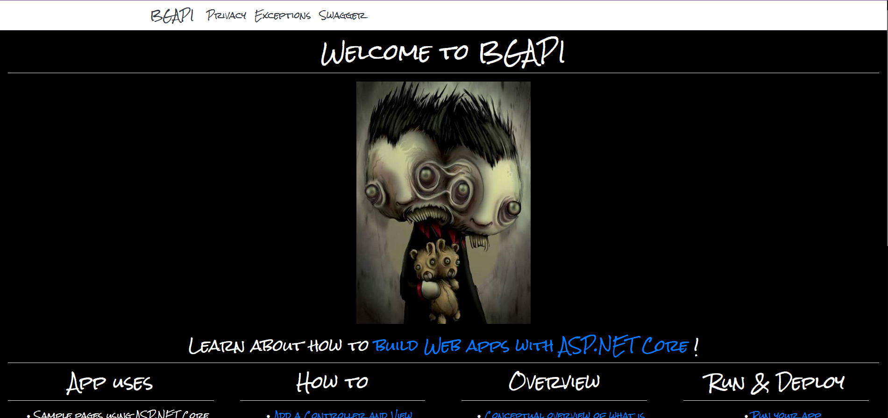
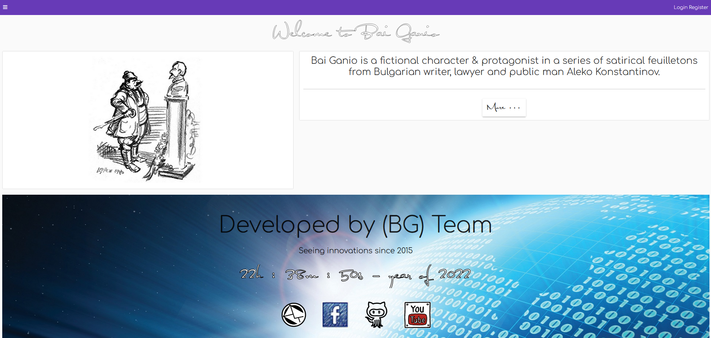
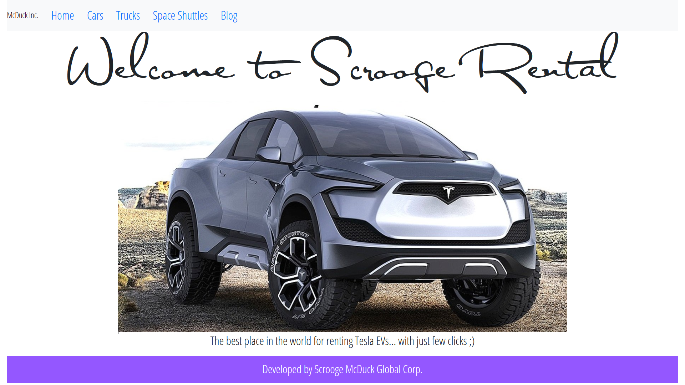
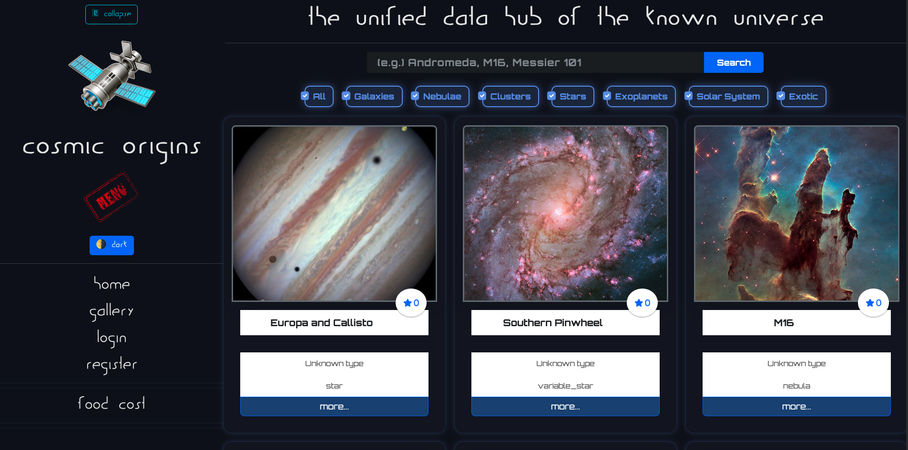
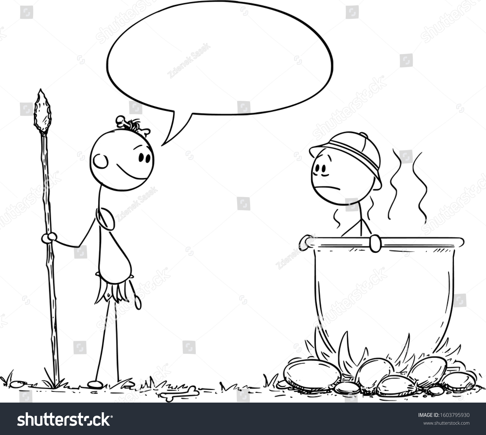

<!-- HEADER --> 

  [ <a href="#metrics">METRICS</a> ]
  · · ·
  [ <a href="#projects">PROJECTS</a> ]  
  · · ·
  [ <a href="#books">BOOKS</a> ]
  · · ·
  [ <a href="#why-bai-ganio">WHY BAI GANIO?</a> ] 
   · · ·
  [ <a href="#me">ME</a> ]

---

 I'm a • Thinker • Philosopher • Software Engineer • Designer of Ideas & Algorithms • Architect of Thought & Code ;/ • 
 

---

  
   
  <b><i>(BBC News) <a href="https://www.bbc.com/news/in-pictures-35639575">In pictures: Sony World Photography Awards shortlist</a> &rarr; Andrey Narchuk's photograph of an inquisitive baby fur seal in the Bering Sea.</i></b>
   
   
  · · · <b>Respect the divercity of the species. We are all unique.</b> · · ·

 
   

  “I've seen a people who can solve a complex problems, and I admire them. But, I'm not one of them. When I have to solve a complex problem, I make it simple first…” 
  <strong>Unknown</strong> 
  · · · 
  
  “At the crossroads of life there are no signposts.” 
  <strong>Charlie Chaplin</strong> 
  · · · 

  “One has to ask a little to be able to pay the price.” 
  <strong>Vanga</strong> 
  · · · 

---
## METRICS

  ··· <strong>live GitHub insights</strong> ···

<!-- Copy-paste in your Readme.md file -->

 <picture>
    <source 
      media="(prefers-color-scheme: dark)" 
      srcset="https://next.ossinsight.io/widgets/official/compose-user-dashboard-stats/thumbnail.png?user_id=10547588&image_size=auto&color_scheme=dark"
    />
    
  </picture>
<!-- Made with [OSS Insight](https://ossinsight.io/) -->

--- 

<h3 align="center"> 🛠 Tech Stack </h3>

  
 

  [<a href="#top">Back to top ↑</a>]

---
## PROJECTS
<b>This section shows workbench projects available so far?!?!</b> 🤔 
❗Read the README.md file in each repo, otherwise the working project might turn into broken one... ;) 😄

<table bordercolor="#66b2b2">
 <!-- START Free IS4 & BGAPI section -->                                                                              
  <tr>                                                                         
    <td valign="top">
      

      <h2><em>Free IS4</em></h2>   
     
     
 Self hosted Identity Server 4 middleware implementation supporting BaiGanio ecosystem of web clients & APIs. Azure SQL Server for storing data. Should be Blazor Web app, but don't know at what timeline it should happen ;)

      
      

      
(Repo): <a target="_blank" href="https://dev.azure.com/teamkepler/_git/Free-IS4"><em>https://dev.azure.com/teamkepler/_git/Free-IS4</em></a>

      
(Site): <a target="_blank" href="https://free-is4.azurewebsites.net/"><em>https://free-is4.azurewebsites.net</em></a>

    </td>
    <td valign="top">
      

      <h2><em>BGAPI</em></h2>     
     .NET 6 Web API supporting GraphQL designed to allows BaiGanio, BackOffice & other public clients to fetch & manipulate public data. Hosted and lives in Azure Cloud, manages data via Azure SQL Server, Firebase NoSQL database as well as Cosmos DB.
       
       
         
    

    
(Repo): <a target="_blank" href="https://dev.azure.com/teamkepler/_git/BGAPI"><em>https://dev.azure.com/teamkepler/_git/BGAPI</em></a>
 
    
(Site): <a target="_blank" href="https://bgapi.azurewebsites.net/"><em>https://bgapi.azurewebsites.net</em></a>
   
    </td>
  </tr>
  <!-- END Free IS4 & BGAPI section -->  
    <!-- START BaiGanio & Looney Tooney --> 
   <tr>                                                                         
    <td valign="top">
      

      <h2><em>baiganio.github.io</em></h2>
         
     
       
Angular App backed with Identity Server 4, .NET Web API, SQL Server, Google Firebase & much more.
   
      
      

      
(Repo): <a target="_blank" href="https://github.com/BaiGanio/baiganio.github.io"><em>https://github.com/BaiGanio/baiganio.github.io</em></a>

      
(Site): <a target="_blank" href="https:/baiganio.github.io/"><em>https:/baiganio.github.io</em></a>

    </td>
    <td valign="top">
      

         <h2><em>Looney Tooney</em></h2>  
         
        
GitHub Pages hosted, pure JavaScript game as a team project back in the days...

      
      

      
(Repo): <a target="_blank" href="https://github.com/Team-Kepler/looney-tooney"><em>https://github.com/Team-Kepler/looney-tooney</em></a>

      
(Site): <a target="_blank" href="https://team-kepler.github.io/looney-tooney/CanvasGame.html"><em>https://team-kepler.github.io/looney-tooney/CanvasGame.html</em></a>

    </td>
  </tr>
  <!-- END BaiGanio & Looney Tooney--> 
  <!-- START Scrooge Rental web and API project secrtion -->
  <tr>
    <td valign="top">
      

      <h3>Scrooge Rental</h3>
      
        
Demo example on how rent-a-car site might look like.
        Built using React.js, GitHub pages, Material UI, GraphQL... & some other data for alignment
        

       
       
      
      

      
(Repo): <a target="_blank" href="https://github.com/BaiGanio/Scrooge-Rental"><em>https://github.com/BaiGanio/Scrooge-Rental</em></a> 

      
(Site): <a target="_blank" href="https://baiganio.github.io/Scrooge-Rental/"><em>https://baiganio.github.io/Scrooge-Rental</em></a>

    </td>
     <td valign="top">
      

      <h3>Scrooge Rental API</h3>
      
    
Azure Cloud hosted, .NET 6 API supporting GraphQL & using free SQL Server from AppHarbor. Demo example of using Azure Service Bus & Azure Function to sparkle the picture.

       
        
      
      

      
(Repo): <a target="_blank" href="https://github.com/BaiGanio/scrooge-rental-api"><em>https://github.com/BaiGanio/scrooge-rental-api</em></a>

      
(Site):  <a target="_blank" href="https://scrooge-rental-api.azurewebsites.net/graphql/"><em>https://scrooge-rental-api.azurewebsites.net/graphql</em></a>

    </td>   
  </tr>  
  <!-- END Scrooge Rental web and API project secrtion -->
   <!-- START COSMIC ORIGINS section -->
  <tr>
    <td valign="top">
      

      <h3>Cosmic Origins</h3>
        
Exoplanets and moons, nebulas, galaxies - just name it.
          SPA built on top of pure HTML, CSS and JavaScript. Fancy look thanks to Bootstrap. Hosted on GitHub pages. Uses Firebase as BaaS & specifically Firestore as database.

       
       
      
      

      
(Repo): <a target="_blank" href="https://github.com/BaiGanio/cosmic-origins"><em>https://github.com/BaiGanio/cosmic-origins</em></a> 

      
(Site): <a target="_blank" href="https://baiganio.github.io/cosmic-origins"><em>https://baiganio.github.io/cosmic-origins<em></a>

    </td>
     <td valign="top">
      

      <h3>Working on it...</h3>
      
    </td>   
  </tr>  
  <!-- END COSMIC ORIGINS section -->
 
</table>

---

## BOOKS

<table>
  <!-- HEADER ROW --> 
  <tr> 
    <th align="center" style="padding: 10px; font-size: 18px;">🇬🇧 English Version</th> 
    <th align="center" style="padding: 10px; font-size: 18px;">🇧🇬 Българска версия</th> 
    <th align="center" style="padding: 10px; font-size: 18px;">🇬🇧 Wiki Game Book</th> 
  </tr>
  <tr>
    <!-- English Version -->
    <td align="center" valign="top">
      

        
          
        <strong>1bit</strong> 
        
          In Progress
        
          
        <small>Release Date: <strong>2027</strong></small>
          
        <!-- Progress Bar --> 
        
 

 

        <small style="opacity:0.8;">40% written</small>
      

       <!-- Download Button 
       <a href="./files/book.pdf" download style="text-decoration:none;"> 
 ⬇️ Download 
 </a>
      --> 
    </td>
    <!-- Bulgarian Version --> 
    <td align="center" valign="top"> 
      
 
         
           
        <strong>1бит</strong>  
         В процес     
        <small>Дата на издаване: <strong>2027</strong></small>    
        <!-- Progress Bar --> 
        
 
          

 
        
 
        <small style="opacity:0.8;">20% написана</small> 
      
 
      <!-- Download Button
       <a href="./files/book.pdf" download style="text-decoration:none;"> 
 ⬇️ Сваляне 
 </a>
       --> 
    </td>
    <!-- Unkindled --> 
    <td align="center" valign="top" width="350"> 
       
         
      <strong>Unkindled</strong>   
      Series on .NET, 🐳 Docker & ☸️ Kubernetes. 
      Practical guides for containerizing and orchestrating modern .NET applications.          
      <a href="https://github.com/BaiGanio/unkindled/wiki"><b>[ENTER THE REALM]</b></a>
    </td>
  </tr>
</table>

  <a href="#top">Back to top ↑</a>

--- 

## WHY BAI GANIO?

**📜 The Remark**

> **The GitHub profile name BaiGanio carries a deliberate literary weight.**  
> Behind it stands Aleko Konstantinov (1863 - 1897). Bulgarian satirist who created the character [Бай Ганьо](https://bg.wikipedia.org/wiki/%D0%91%D0%B0%D0%B9_%D0%93%D0%B0%D0%BD%D1%8C%D0%BE) (Bai Ganio) and wrote with unmatched clarity about society, ambition, and the contradictions of modernization.

> **Aleko — known by the pseudonym ["Щастливеца"](https://bg.wikipedia.org/wiki/%D0%90%D0%BB%D0%B5%D0%BA%D0%BE_%D0%9A%D0%BE%D0%BD%D1%81%D1%82%D0%B0%D0%BD%D1%82%D0%B8%D0%BD%D0%BE%D0%B2) (The Lucky One)— used satire to expose the emerging flaws of a rapidly changing Bulgaria.** 
> He was a lawyer, writer, traveler, and one of the earliest Bulgarian observers of Western progress, describing his journeys to Paris, Prague, and [Chicago](https://www.goodreads.com/author/show/6805445.Aleko_Konstantinov).

> **Aleko was "The Lucky One" not because of fortune, but because he believed in movement, progress, and public good.** 
> Aleko created a character bigger than himself.
> And like him, I'm creating a GitHub ecosystem bigger than a single repo — a living, self‑maintaining knowledge graph.

  <a href="#top">Back to top ↑</a>

---

## ME

<table>
<tr>
<td width="360">

</td>
<td>

🔭 **Working on:** building strange and beautiful systems, workflows, and conceptual architectures that blend philosophy, technology & aesthetics & pretend to be simple.  
🌱 **Learning:** deeper algorithmic patterns, data structures, and meta‑frameworks for scalable thinking or whatever makes my brain go "aha".  
👯 **Collaboration:** open to projects involving conceptual design, algorithmic mastery, with humans who enjoy structure, philosophy, and a little bit of mischief.  
🤔 **Need help with:** anything that requires 17 hands or a second brain.  
💬 **Ask me about:** systems thinking, conceptual design, algorithms, software architectures, or why simplicity is the ultimate flex.  
📫 **Contact:** …  
😄 **Pronouns:** he/him  
⚡ **Fun fact:** I treat writing, coding, and design as one craft — different languages for the same structure. And the ideas like Lego — break them apart, rebuild them, and pretend it was intentional all along.

</td>
</tr>
</table>

  <a href="#top">Back to top ↑</a>

---

<!--

  
  
  
https://www.youtube.com/channel/UCczegwwjd8YyeophFBIJ4EA
  

-->

