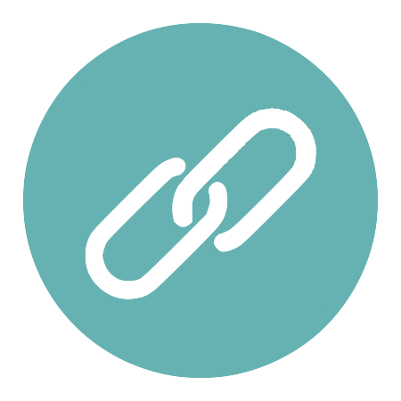

  
  
  
  

## &#x1f4c8; GitHub Stats

<table>
  <tr>
    <td>
    
    </td>
    <td>
        
        
        
        
    </td>
    <td>
        
        
        
        
        
        
        
    </td>
    <td>
        
        
        
        
        
    </td>
  </tr>
</table>

---

<table bordercolor="#66b2b2">
  <tr>
    <td width="33%" valign="top">
      
      <h3>avoCart</h3>
         
        
<a href="https://github.com/the-collab-lab/tcl-22-smart-shopping-list">Repo</a> // <a href="https://tcl-22-shopping-list.web.app/">Site</a> // <a href="https://youtu.be/XJ5hsiWm7Z0?t=90">Demo</a>

         
        
Smart shopping list that learns your buying habits and helps you remember what you need to buy on your next trip to the store.  
        Built using React.js, Firebase, Material UI, and Styled Components

        
    </td>
    <td width="33%" valign="top">
      
      <h3>Couch Potato</h3>
         
        
<a href="https://github.com/2001-math-max-fury-road/CouchPotato">Repo</a> // <a href="https://chrome.google.com/webstore/detail/couch-potato/aheloceipokicgchednkbmlaejgcpllo?hl=en-US">Extension</a> // <a href="https://www.youtube.com/watch?v=CQt5qoKtEBU">Demo</a>

         
        
A Chrome extension allowing multiple users to stream video content together remotely.   
        Built using JavaScript, React.js, Express.js, Socket.io, and Heroku

        
    </td>
  </tr>
</table>

---

---

---

### Working Demos
Read the _`README.md`_ file in each repo, otherwise the working demo might turn into broken one... ;) 😄🤔
 - Site: <a target="_blank" href="https://baiganio.github.io/">https://baiganio.github.io/</a>
   - Angular App backed with Identity Server 4, .NET Web API, SQL Server, Google Firebase & much more...
   - [repo files](https://github.com/BaiGanio/baiganio.github.io)
 - Site: <a target="_blank" href="https://baiganio.github.io/backoffice/">https://baiganio.github.io/backoffice/</a>
   - React App backed with .NET Web API & SQL Server
   - [repo files](https://github.com/BaiGanio/backoffice) 
- Site: <a target="_blank" href="https://baiganio.github.io/Scrooge-Rental/">https://baiganio.github.io/Scrooge-Rental/</a>
   - React App with GraphQL example
   - [repo files](https://github.com/BaiGanio/Scrooge-Rental) 
- Site: <a target="_blank" href="https://baiganio.github.io/company-house/">https://baiganio.github.io/company-house/</a>
   - Angular App backed with .NET Web API, SQL Server & Azure Functions
   - [repo files](https://github.com/BaiGanio/company-house) 
- Site: <a target="_blank" href="https://baiganio.github.io/space-university/">https://baiganio.github.io/space-university/</a>
   - Pure JS + Bootstrap shugar + jQuery + Google Firebase
   - [repo files](https://github.com/BaiGanio/space-university) 
- Site: <a target="_blank" href="https://baiganio.github.io/js4b">https://baiganio.github.io/js4b</a>
   - Pure JS & Bootstrap shugar
   - [repo files](https://github.com/BaiGanio/js4b)
- Site: <a target="_blank" href="https://team-kepler.github.io/looney-tooney/CanvasGame.html">https://team-kepler.github.io/looney-tooney/CanvasGame.html</a>
   - Pure JS game as a team project back in the days...
   - [repo files](https://github.com/Team-Kepler/looney-tooney)

---

<!--
### Hi there 👋
## Stargazers

-->

<!--
**BaiGanio/baiganio** is a ✨ _special_ ✨ repository because its `README.md` (this file) appears on your GitHub profile.

Here are some ideas to get you started:

- 🔭 I’m currently working on ...
- 🌱 I’m currently learning ...
- 👯 I’m looking to collaborate on ...
- 🤔 I’m looking for help with ...
- 💬 Ask me about ...
- 📫 How to reach me: ...
- 😄 Pronouns: ...
- ⚡ Fun fact: ...
-->
